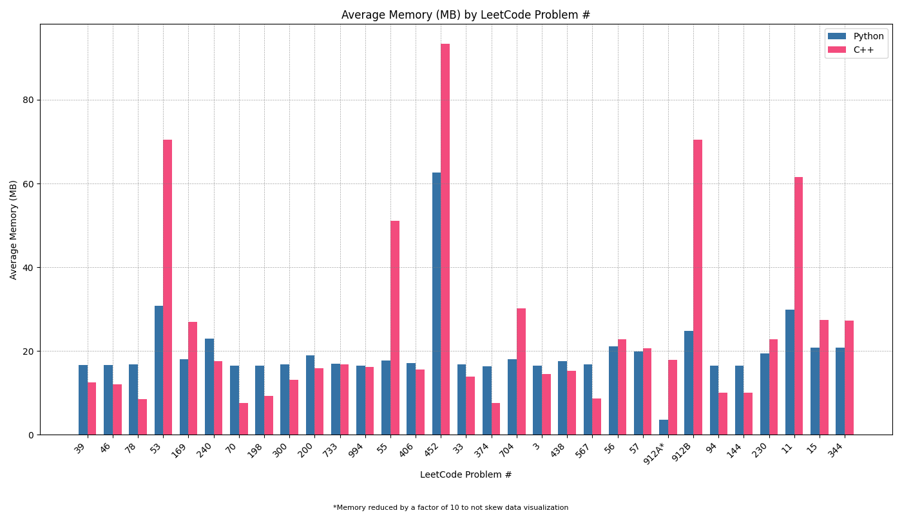
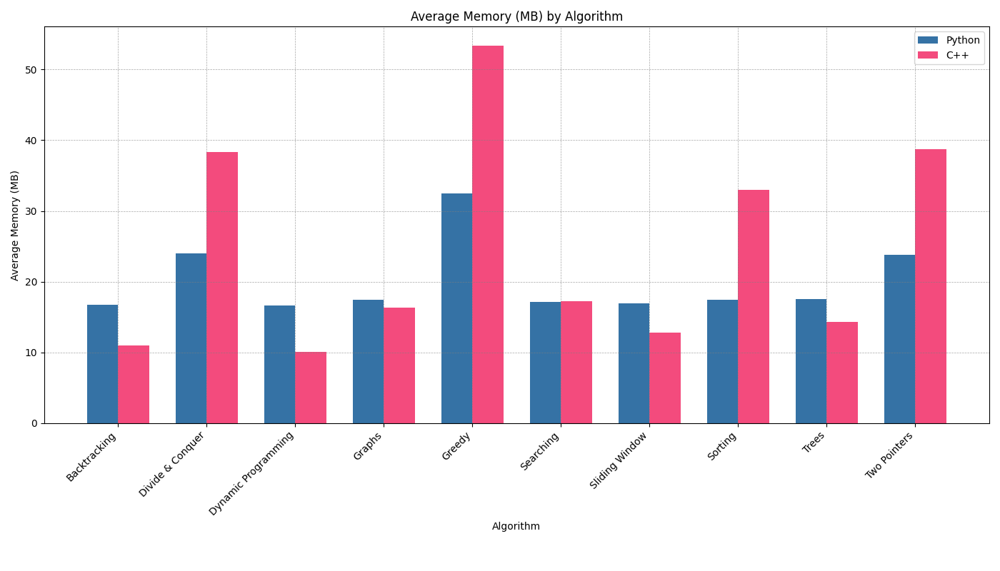

# Analyzing Python and C++ Performance in LeetCode Problems

## Premise

It is well documented that C++ is faster than Python when it comes to raw processing speed… but just how much faster is it? Does it also use less memory than Python? As someone who hasn’t coded in C++ before, I wanted to find the answers to these questions while simultaneously familiarizing myself with the syntax of C++. This repository details my expedition through various algorithmic challenges with both languages, as well as the surprising insights I found at journey’s end.

Do note that since this is a didactic project with a focus on C++, the solutions in C++ contain additional lines of code not found in the Python solutions. These additional lines of code were not part of the submitted solutions.

If you would like to skip to the comparative charts, [click here](#charts).

## Method

To make the comparison concrete, I first selected 10 different algorithmic problem sets featured on LeetCode. From these sets, I chose 3 representative problems.

For each problem, I developed a solution in Python and then translated that solution into C++ (with one exception that I'll touch on later). I aimed to keep the logic and structure as similar as possible between the two languages to allow for a fair comparison.

The exception case I mentioned earlier was LeetCode problem 912, which was part of the selections focusing on sorting algorithms. Given that there is a built-in method that can reduce an otherwise lengthy solution down to a couple lines of code in both languages, I felt both approaches merited inclusion.

Once I was satisfied with the solutions, I submitted each solution three times in the LeetCode sandbox to procure a broader dataset. I recorded the runtime (in milliseconds) and memory usage (in megabytes) for each submission, then averaged those values to obtain a single runtime and memory figure for each problem. After that, I averaged the mean values for each problem to get an average runtime and memory figure for each algorithm. The runtime and memory figures for each problem and algorithm served as the cornerstones of this performance comparison.

Before getting to the results, I want to acknowledge that LeetCode is not the ideal way to test the efficacy of each language’s solutions. Both runtime and memory readings can be skewed by the quality of the user’s machine or by the number of users on the LeetCode platform at the time of testing. However, given the prevalence of LeetCode style coding challenges in competitive programming, it was a logical choice to streamline performance testing.

## Results

Shocking absolutely no one, C++ outperformed Python in terms of speed in every algorithm. On average, C++ was 5.253 times faster than Python. You can view how much faster C++ was than Python in each algorithm below:

Runtime Comparison

 

* Backtracking - 36x faster
* Divide & Conquer - 2.221x faster
* Dynamic Programming - 28.781x faster
* Graphs - 18.423x faster
* Greedy - 3.837x faster
* Searching - 11.804x faster
* Sliding Window - 3.068x faster
* Sorting - 5.092x faster
* Trees - 8.999x faster
* Two Pointers - 9.307x faster
 

* Python average runtime – 72.082ms
* C++ average runtime – 13.721ms
 

* Overall average – C++ was 5.253x faster

On the other hand, the memory usage results were actually quite surprising. On average, Python used 4.509 fewer MB than C++. In fact, Python used significantly less memory (>10MB) than C++ in 4 out of the 10 algorithmic comparisons. This finding challenges the common perception that Python is always the more resource-intensive option.

Memory Comparison

 

* Backtracking – C++ used 5.716 fewer MB
* Divide & Conquer – Python used 14.417 fewer MB
* Dynamic Programming – C++ used 6.579 fewer MB
* Graphs – C++ used 1.161 fewer MB
* Greedy – Python used 20.859 fewer MB
* Searching – Python used 0.112 fewer MB
* Sliding Window – C++ used 4.131 fewer MB
* Sorting – Python used 15.538 fewer MB
* Trees – C++ used 3.183 fewer MB
* Two Pointers – Python used 14.934 fewer MB
 

* Python average memory usage – 20.015MB
* C++ average memory usage – 24.524MB
 

* Overall average – Python used 4.509 fewer MB

## Average Runtime (ms) by LeetCode Problem #

## Average Runtime (ms) by Algorithm

## Average Memory (MB) by LeetCode Problem #

## Average Memory (MB) by Algorithm
